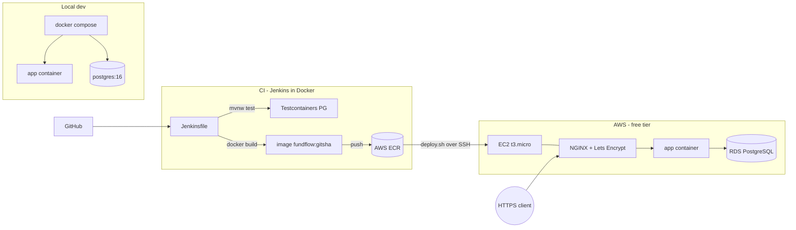

# FundFlow — Capital Call Tracker

REST API for venture-capital fund administration: track LP commitments, issue
capital calls split **pro-rata** across investors, record payments, and watch
fund-level called/paid/outstanding totals roll up automatically.

Built as a DevOps portfolio project: every layer from `@Entity` to TLS
termination is in this repo.

## Architecture



## Domain model

| Entity | Purpose |
|---|---|
| `Fund` | name, vintage year, target size, currency |
| `Investor` | an LP (name, email) |
| `Commitment` | how much an LP committed to a fund (join entity) |
| `CapitalCall` | a call on a fund: number, total, due date, status `DRAFT → ISSUED → PARTIALLY_PAID → PAID` |
| `CallAllocation` | one LP's pro-rata share of a call, with paid tracking |

**Core rule:** creating a capital call splits it across LPs proportionally to
their commitments, rounded down to the cent, with the rounding remainder
absorbed by the largest commitment — allocations always sum *exactly* to the
call total. Paying allocations rolls the call status up automatically.

## Run it locally

```bash
docker compose up -d        # app + PostgreSQL, seeded with demo data
```

- Swagger UI: <http://localhost:8080/swagger-ui/index.html>
- Health: <http://localhost:8080/actuator/health>

Or hybrid (DB in Docker, app on your JDK): `docker compose up -d db && ./mvnw spring-boot:run`

## API at a glance

| Method & path | What it does |
|---|---|
| `POST /api/v1/funds` · `GET /api/v1/funds/{id}` ·  `PUT` · `DELETE` | fund CRUD |
| `POST /api/v1/investors` … | investor CRUD |
| `POST /api/v1/funds/{id}/commitments` | LP commits capital to a fund |
| `POST /api/v1/funds/{id}/capital-calls` | create call + auto-allocate pro-rata |
| `POST /api/v1/capital-calls/{id}/issue` | DRAFT → ISSUED (makes allocations payable) |
| `POST /api/v1/allocations/{id}/pay` | mark an LP's share paid, roll up call status |
| `GET /api/v1/funds/{id}/summary` | committed / called / paid / outstanding |

Errors come back in one consistent shape (`status`, `message`, `path`,
`fieldErrors`) via a global `@RestControllerAdvice` — validation 400s,
not-found 404s, business-rule 409s.

## Tests

```bash
./mvnw test        # needs Docker for the integration tests
```

- **17 unit tests** (Mockito, no Spring): allocation math incl. an
  invariant-style "allocations always sum to total" parameterized test, and the
  full call state machine.
- **7 integration tests** (Testcontainers, real PostgreSQL): service-layer
  lifecycle + HTTP-level contract (validation shape, 404/409, malformed JSON).

## CI/CD

Declarative [Jenkinsfile](Jenkinsfile): checkout → `mvnw test` (JUnit reports)
→ `docker build` tagged with the **short git SHA** → push to ECR → SSH deploy
to EC2 with a health-check gate. The AWS stages skip cleanly until credentials
exist in Jenkins, so the same pipeline runs everywhere.

Run Jenkins locally (controller image bundles Docker CLI + AWS CLI):

```bash
cd jenkins && docker compose up -d --build
# UI on http://localhost:8081 — initial password:
docker exec fundflow-jenkins cat /var/jenkins_home/secrets/initialAdminPassword
```

## Deployment

- [docs/aws-deployment.md](docs/aws-deployment.md) — ECR, EC2 (t3.micro), RDS
  (db.t3.micro), security groups (only 22/80/443 in; DB reachable from app SG
  only), IAM, free-tier guardrails, teardown.
- [scripts/deploy.sh](scripts/deploy.sh) — pull-and-restart over SSH with
  health verification; used by Jenkins and runnable by hand.
- [docs/tls-setup.md](docs/tls-setup.md) — NGINX reverse proxy + Let's Encrypt
  on a free DuckDNS subdomain.

## Screenshots

> _placeholders — add after first AWS deploy_
>
> - Swagger UI on the public HTTPS domain
> - Jenkins green pipeline run with all 5 stages
> - `GET /funds/1/summary` response

## DevOps highlights

- **Multi-stage Dockerfile** — JDK+Maven build stage, JRE-alpine runtime
  (374 MB vs ~1.2 GB single-stage), **non-root user**, Spring Boot layertools
  extraction so a code change re-ships ~50 KB, not 50 MB.
- **Immutable, traceable artifacts** — images tagged with the git SHA; any
  running container maps to an exact commit.
- **Same image everywhere** — config is 12-factor env vars
  (`DB_URL`, `DDL_AUTO`, `SQL_INIT_MODE`); dev/prod differ only in environment.
- **Tests against the real database engine** — Testcontainers PostgreSQL, not
  H2; CI runs them through the mounted Docker socket.
- **No secrets in the repo** — Jenkins credential store + `.env` (gitignored);
  pipeline stages activate via `when` guards once credentials exist.
- **Healthcheck-gated everything** — compose `depends_on: service_healthy`,
  Docker healthchecks, deploy script fails loudly if `/actuator/health`
  doesn't go UP.
- **Least-privilege networking** — security groups open 22/80/443 only;
  Postgres accepts connections solely from the app's security group.
